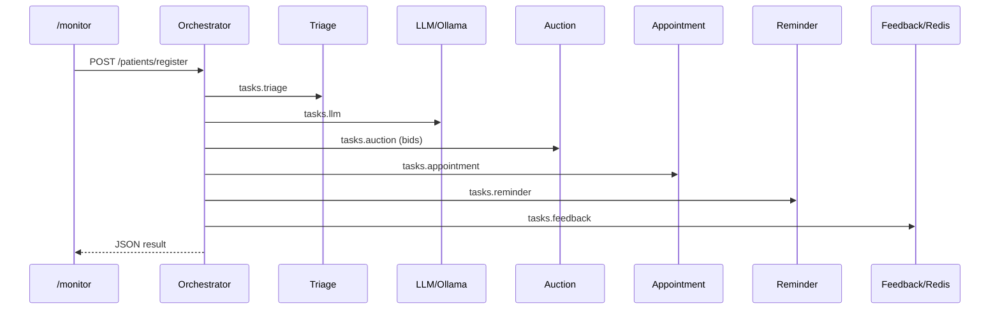

# Лабораторная работа №13 — Система поддержки пациентов

**Студент:** Тарасов Вадим Романович  
**Группа:** 221131  
**Вариант:** 18 (повышенная сложность)

**Предметная область:** запись к врачу, напоминание о приёме, сбор обратной связи, триаж.

---

## Быстрый старт

```bash
cp .env.example .env
docker compose up --build
```

Опционально — включить Ollama (облачный/локальный LLM):

```bash
docker compose --profile ollama up -d
docker exec -it lab13_mas-ollama-1 ollama pull llama3.2
```

Без профиля `ollama` LLM-агент использует встроенный fallback (правила по ключевым словам).

| Сервис | URL |
|--------|-----|
| API / Swagger | http://localhost:8000/docs |
| Мониторинг | http://localhost:8000/monitor |
| Jaeger | http://localhost:16686 |

---

## Реализация 8 заданий (повышенная сложность)

| № | Задание | Где реализовано |
|---|---------|-----------------|
| 1 | 4+ Go-агента + NATS | `agents/triage`, `appointment`, `reminder`, `feedback` + `docker-compose.yml` |
| 2 | Pipeline | `orchestrator/app/main.py` → triage → llm → appointment → reminder → feedback |
| 3 | Jaeger + OpenTelemetry | OTLP во всех Go-агентах, оркестраторе; W3C trace через NATS headers |
| 4 | Stateful Redis | `agents/feedback` — счётчики, средний балл, ping при старте |
| 5 | Автомасштабирование | `orchestrator/app/autoscale.py` — очередь в Redis, `docker compose scale` |
| 6 | Аукцион | `tasks.auction` — агенты шлют `{cost, skill}`; оркестратор выбирает минимум |
| 7 | LLM-агент | `agents/llm` — Ollama API + fallback на правила |
| 8 | Веб-мониторинг | `GET /monitor` — Jinja2: агенты, очередь, аукцион, форма запуска |

---

## API

`POST /patients/register`

```json
{
  "patient_id": "PAT001",
  "first_name": "Иван",
  "last_name": "Петров",
  "symptoms": ["chest pain"],
  "urgency": "high",
  "rating": 5
}
```

---

## Архитектура



---

## Проверка для преподавателя

1. `docker compose up --build` — все сервисы в статусе running.
2. http://localhost:8000/monitor — форма «Запустить pipeline».
3. http://localhost:16686 — трейсы `patient-pipeline`, `auction.collect_bids`.
4. `GET /status` — очередь, последний аукцион, счётчик задач.

---

## Тесты

```bash
cd orchestrator && pip install -r requirements.txt && pytest app/tests -v
cd agents/triage && go test ./...
```
