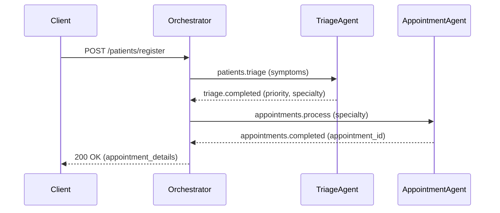
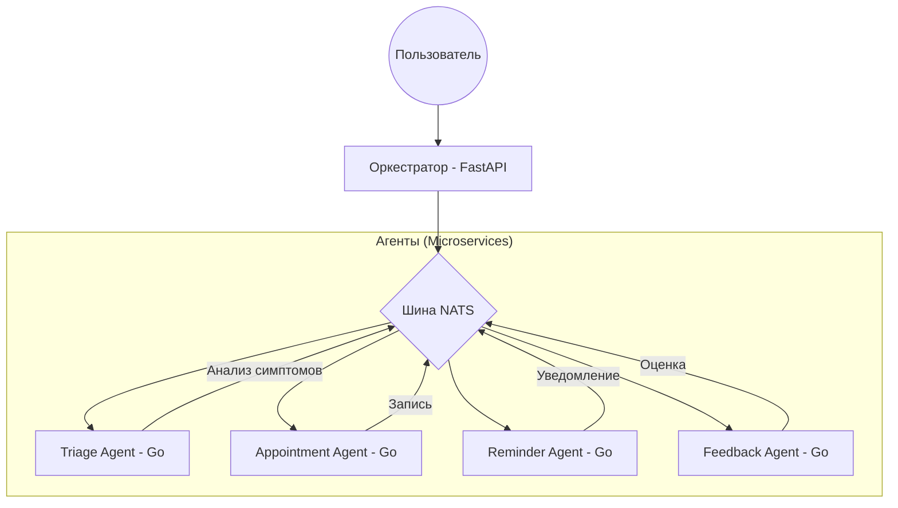

# 🏥 Система поддержки пациентов (Lab 13)

Система автоматизации процессов записи и обслуживания пациентов на базе микросервисной архитектуры. Реализована в рамках лабораторной работы №13 (Вариант 18).

**Студент:** Тарасов Вадим Романович, группа 221131

---

## 🏗 Архитектура системы

Система состоит из центрального **Оркестратора** (Python/FastAPI) и четырех **Микросервисов-агентов** (Go), обменивающихся сообщениями через **NATS**.

### Диаграмма взаимодействия (Pipeline)



### Схема компонентов



---

## ⚙️ Агенты системы

1. **Triage Agent (Go):** Анализирует жалобы и симптомы, классифицирует серьезность и рекомендует специалиста.
2. **Appointment Agent (Go):** Отвечает за логику записи на прием.
3. **Reminder Agent (Go):** Генерирует напоминания о визитах.
4. **Feedback Agent (Go):** Собирает отзывы пациентов.

## 🚀 Быстрый старт

1. Склонируйте репозиторий.
2. Запустите всю систему командой:
```bash
docker compose up --build

```


3. API будет доступно по адресу `http://localhost:8000`.

## 📡 Примеры API-запросов

**Регистрация пациента:**
`POST /patients/register`

```json
{
  "patient_id": "PAT001",
  "first_name": "Иван",
  "last_name": "Петров",
  "symptoms": ["chest pain"],
  "urgency": "high"
}

```

## 🛡 Отказоустойчивость

* **Таймауты:** Оркестратор ждет ответа от агентов не более 5 секунд.
* **Изоляция:** Каждый агент функционирует в отдельном контейнере, отказ одного не блокирует остальные.

```

---

