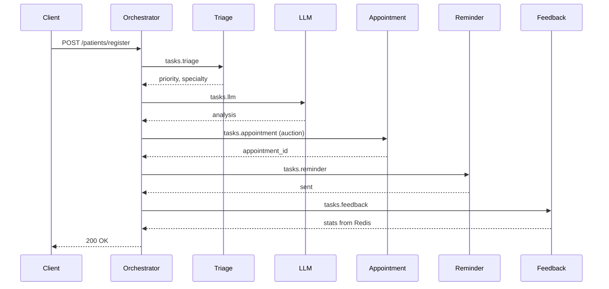

# Лабораторная работа №13 — Система поддержки пациентов

**Студент:** Тарасов Вадим Романович  
**Группа:** 221131  
**Вариант:** 18  
**Сложность:** Повышенная  

Система автоматизации записи и обслуживания пациентов на базе мультиагентной архитектуры (MAS).

**Предметная область:** запись к врачу, напоминание о приёме, сбор обратной связи, триаж.

---

## Архитектура

| Компонент | Технология | Роль |
|-----------|------------|------|
| Оркестратор | Python / FastAPI | Pipeline, аукцион, retry, REST API |
| Triage Agent | Go | Классификация симптомов, приоритет |
| Appointment Agent ×2 | Go | Запись к врачу (балансировка + аукцион) |
| Reminder Agent | Go | Напоминания о визите |
| Feedback Agent | Go + Redis | Stateful-сбор отзывов |
| LLM Agent | Python | Анализ симптомов (имитация LLM) |
| NATS | Docker | Брокер сообщений |
| Jaeger | Docker | Распределённая трассировка (OpenTelemetry) |

### Pipeline



---

## Быстрый старт

```bash
cp .env.example .env
docker compose up --build
```

- API: http://localhost:8000/docs
- Мониторинг: http://localhost:8000/monitor
- Jaeger: http://localhost:16686

---

## API

### Регистрация пациента (основной endpoint)

`POST /patients/register`

```json
{
  "patient_id": "PAT001",
  "first_name": "Иван",
  "last_name": "Петров",
  "symptoms": ["chest pain"],
  "urgency": "high",
  "appointment_date": "2026-05-25",
  "rating": 5
}
```

### Статус системы

- `GET /health` — проверка работоспособности
- `GET /status` — агенты, счётчик задач, аукцион
- `GET /monitor` — веб-панель мониторинга

---

## Реализованные требования (повышенная сложность)

1. **4 Go-агента + LLM** — triage, appointment (×2), reminder, feedback, llm
2. **Pipeline** — последовательная цепочка через оркестратор
3. **Jaeger / OpenTelemetry** — OTLP exporter в оркестраторе и агентах
4. **Stateful (Redis)** — feedback-agent хранит счётчики в Redis
5. **Автомасштабирование** — проверка длины очереди в оркестраторе
6. **Аукцион** — выбор appointment-agent с минимальным `cost`
7. **LLM-агент** — анализ симптомов на Python
8. **Мониторинг** — `/monitor`, `/status`

Дополнительно: **retry до 3 раз**, **логи в файл**, **Request-Reply NATS**, **2 экземпляра appointment-agent**.

---

## Тесты

```bash
cd orchestrator
pip install -r requirements.txt
pytest app/tests -v
```

```bash
cd agents/triage
go test ./...
```
